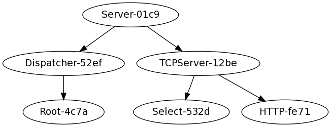

Component Architecture
======================

circuits has a **Component Architecture**.

circuits employs a strong Component Architecture in it's design.
What is a Component Architecture ? In the context of circuits it's
best described as a way of completely decoupling every part of the
system or application. Each Component knows nothing of any of the
other components in the system. This kind of architecture can be
a very powerful tool if used properly.

Other articles on the subject describe the Component Architecture
differently, but nonetheless, here are some good reference and reading
material:
* `Component based Software Engineering <http://en.wikipedia.org/wiki/Software_componentry>`_ (*wikipedia*)
* `Trac's excellent Component Architecture <http://trac.edgewall.org/wiki/TracDev/ComponentArchitecture>`_

The design of circuits is such that the circuits framework containing useful
features in application development, networking and web development is all
implemented as simple and complex components. Functionality of an application
or system is created in components and the interaction of those components.

A good example of this is a simple web application displaying the traditional
"Hello World!" greeting:

:download:`web.py <../examples/web.py>`

.. literalinclude:: ../examples/web.py
   :language: python
   :linenos:

This very simple example demonstrates and makes use of the following set of components::

 * Server
  * TCPServer
   * Select
   * HTTP
  * Dispatcher
   * Root
    * Controller

We won't go into the any details about how these components interact with each
other or what their purpose is in such a simple web application, but it should
clearly outline the inherent **Component Architecture** behind circuits.

As a better picture of this, here's a visual graph of this simple example:

