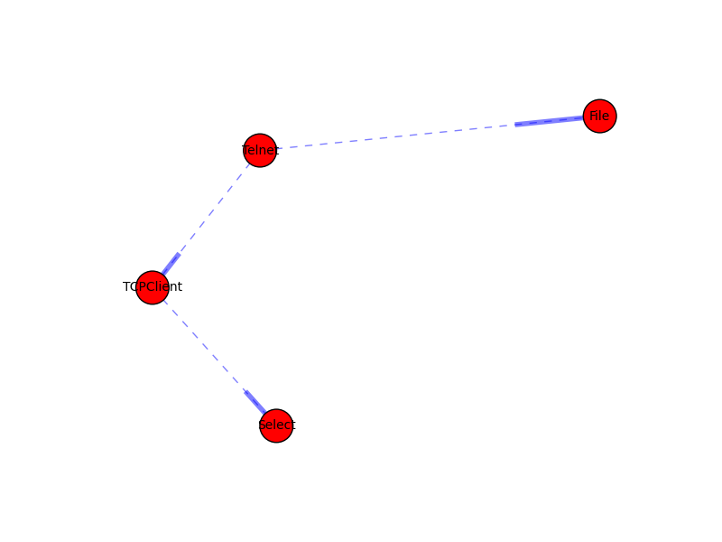

Tools
=====

There are two main tools of interest in circuits.
These are:

- :py:func:`circuits.tools.inspect`
- :py:func:`circuits.tools.graph`

These can be found in the :py:mod:`circuits.tools` module.

Introspecting your Application
------------------------------

The :py:func:`~circuits.tools.inspect` function is used to help
introspect your application by displaying all the channels
and events handlers defined through the system including
any additional meta data about them.

Example:

.. code:: pycon
    
    >>> from circuits import Component
    >>> class App(Component):
    ...     def foo(self):
    ...             pass
    ... 
    >>> app = App()
    >>> from circuits.tools import inspect
    >>> print(inspect(app))
     Components: 0

     Event Handlers: 3
      unregister; 1
       <handler[*][unregister] (App._on_unregister)>
      foo; 1
       <handler[*][foo] (App.foo)>
      prepare_unregister_complete; 1
       <handler[<instance of App>][prepare_unregister_complete] (App._on_prepare_unregister_complete)>
   

Displaying a Visual Representation of your Application
------------------------------------------------------

The :py:func:`~circuits.tools.graph` function is used to help
visualize the different components in your application and
how they interact with one another and how they are registered
in the system.

In order to get a image from this you must have the following
packages installed:

- `networkx <http://pypi.python.org/pypi/networkx>`_
- `pygraphviz <http://pypi.python.org/pypi/pygraphviz>`_
- `matplotlib <http://pypi.python.org/pypi/matplotlib>`_

You can install the required dependencies via::
    
    pip install matplotlib networkx pygraphviz

Example:

.. code:: pycon
    
    >>> from circuits import Component, Debugger
    >>> from circuits.net.events import write
    >>> from circuits.net.sockets import TCPServer
    >>> 
    >>> class EchoServer(Component):
    ...     def init(self, host="0.0.0.0", port=8000):
    ...             TCPServer((host, port)).register(self)
    ...             Debugger().register(self)
    ...     def read(self, sock, data):
    ...             self.fire(write(sock, data))
    ... 
    >>> server = EchoServer()
    >>>
    >>> from circuits.tools import graph
    >>> print(graph(server))
    * <EchoServer/* 784:MainThread (queued=2) [S]>
     * <TCPServer/server 784:MainThread (queued=0) [S]>
     * <Debugger/* 784:MainThread (queued=0) [S]>
    
An output image will be saved to your current working directory
and by called ``<name>.png`` where **<name>** is the name of
the top-level component in your application of the value you pass
to the ``name=`` keyword argument of ``~circuits.tools.graph``.

Example output of `telnet Example <https://github.com/circuits/circuits/tree/master/examples/telnet.py>`_:

And its DOT Graph:

.. graphviz:: ../examples/Telnet.dot
